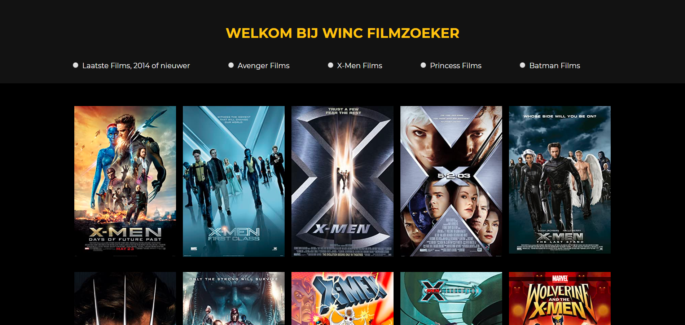

# Project 2 - Filmzoeker

➙ [Bekijk het project](http://jannekecoumans.nl/html/filmzoeker/index.html)

##  Doel van het project:
In dit project hebben we een filmzoeker gemaakt die films uit een database toont op de DOM.

## Requirements:
- Als gebruiker wil ik een lijst kunnen zien van de beschikbare films met de poster van de film.

- Als gebruiker wil ik bovenaan de pagina kunnen klikken op 5 verschillende filters in de vorm van radio-buttons.

- Als gebruiker kan ik maar 1 filter tegelijk gebruiken. 

- Als gebruiker kan ik op de poster van de film klikken, waardoor ik naar de juiste IMDB pagina wordt gebracht. 
